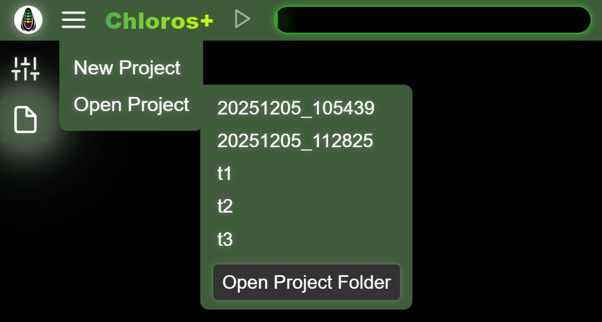

# Lietotāja saskarne: Projekti

Chloros ļauj izveidot projektus, kurus varēsiet atvērt vēlāk.

## Jauns projekts

<figure><figcaption></figcaption></figure>Izvēlieties &quot;Jauns projekts&quot; galvenajā izvēlnē un ievadiet unikālu nosaukumu savam projektam.

## Atvērt projektu

<figure><figcaption></figcaption></figure>Izvēlieties &quot;Atvērt projektu&quot;, lai redzētu esošo projektu sarakstu projekta mapē. Ja nav neviena projekta, papildu sānu izvēlne neparādīsies. Augšējā attēlā redzami daži GUI izveidoti projekti (t1, t2, t3). Projektus DATE\_TIME izveidoja CLI, izmantojot noklusējuma projektu nosaukumu shēmu. Noklikšķinot uz jebkura projekta nosaukuma, tas tiks atvērts.

Noklikšķinot uz pogas „Atvērt projekta mapi”, atvērsies jūsu datora failu pārlūks projekta ceļā. Jūs varat pielāgot projekta ceļu [Projekta iestatījumos](project-settings/project-settings.md).

## Pievienot failus

Pēc projekta atvēršanas izvēlieties &quot;Pievienot failus&quot; galvenajā izvēlnē, lai pievienotu atsevišķus attēlu failus pašreizējam projektam. Šī funkcija atspoguļo failu pārlūka pievienošanas funkciju, bet ērtības labad ir pieejama tieši no galvenās izvēlnes.

## Pievienot mapi

Pēc projekta atvēršanas izvēlieties &quot;Pievienot mapi&quot; galvenajā izvēlnē, lai pievienotu visu attēlu mapi pašreizējam projektam. Dublikāti tiek ignorēti.

## Apstrādes sākšana / apturēšana

Pēc failu pievienošanas projektam galvenajā izvēlnē kļūst pieejama opcija &quot;Sākt apstrādi&quot;. Šī darbība ir tāda pati kā uzklikšķinot uz pogas &quot;Atskaņot/Sākt&quot; augšējā galvenajā joslā. Apstrādes laikā izvēlnes opcija mainās uz &quot;Apturēt apstrādi&quot;, lai ļautu jums apturēt apstrādes procesu.


Izvēles „Pievienot failus”, „Pievienot mapi” un „Sākt/apstādināt apstrādi” ir redzamas vai pieejamas tikai tad, ja projekts ir atvērts un faili ir pievienoti. Tās nodrošina ātru piekļuvi darbībām, kas ir pieejamas arī caur failu pārlūka sānu joslu un galvenes pogām.

